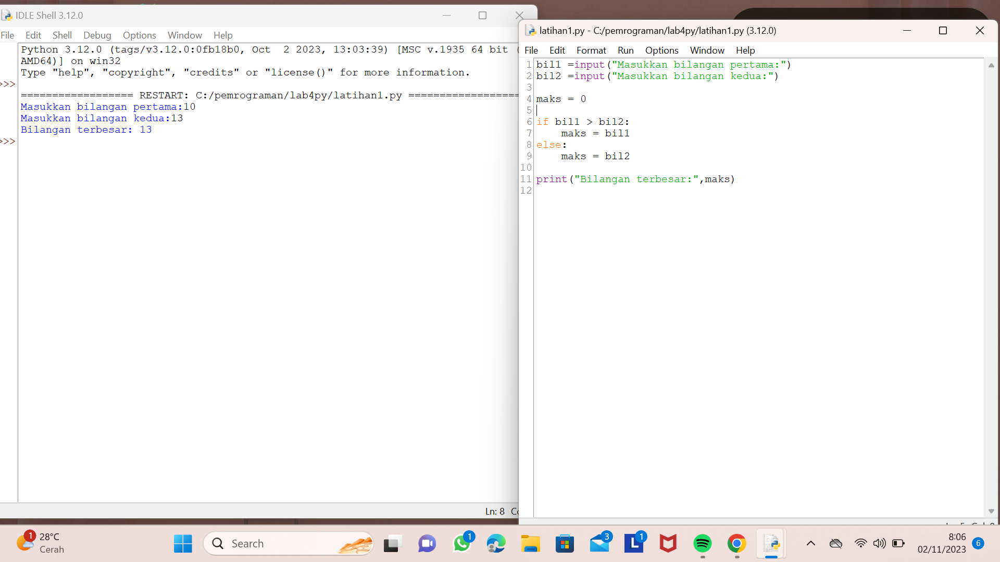
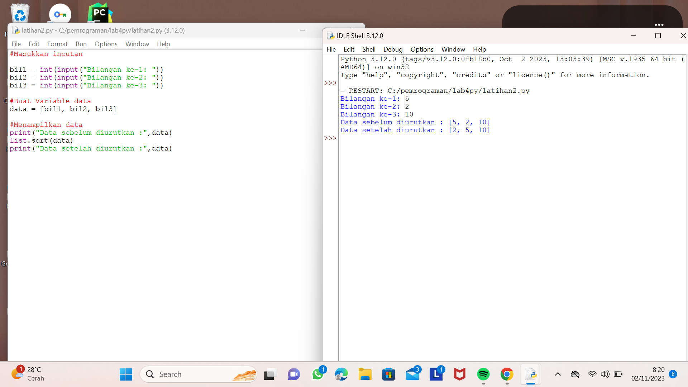
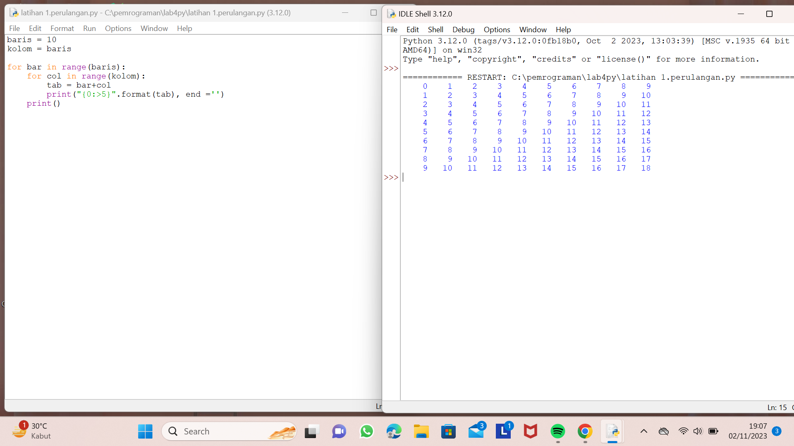
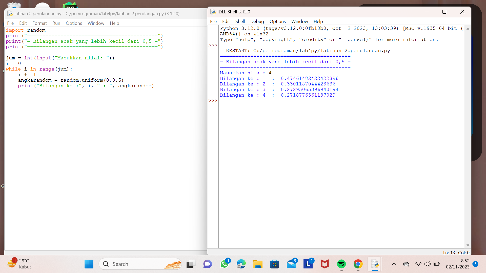
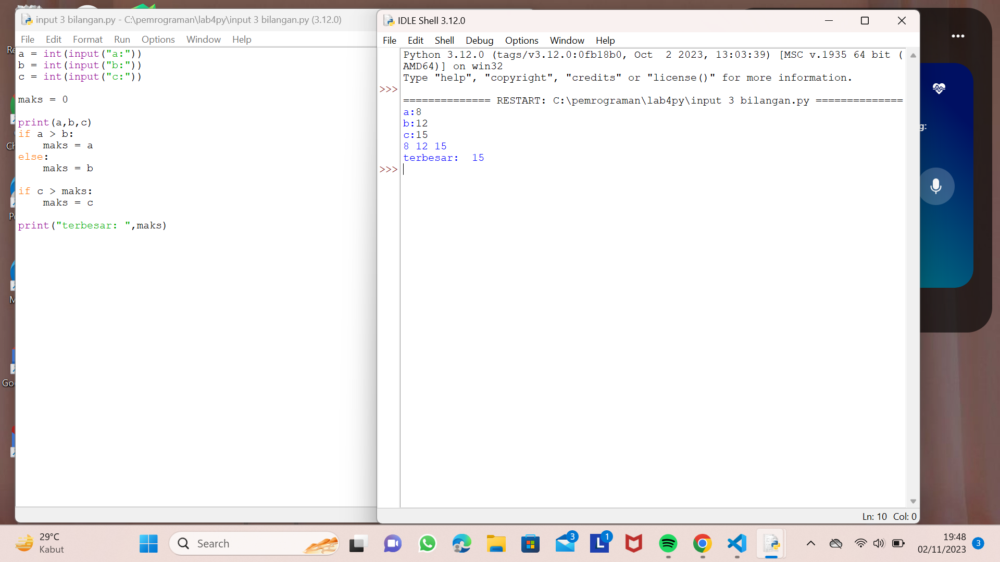

TUGAS STRUKTUR KONDISI

LATIHAN 1

Membuat program sederhana dengan input 2 buah bilangan, kemudian menentukan bilangan terbesar dari kedua bilangan tersebut mengunakan pernyataan if 

latihan 2

Membuat program untuk mengurutkan data berdasarkan input sejumlah data (minimal 3 input variabel atau lebih ), kemudian tampilkan hasilnya secara mulai berurutan dari data terkecil

list.sort sintaks ini berfungsi untuk mengurutkan data

Tugas Perulangan

Membuat program dengan perulangan bertingkat (nested) untuk menghasilkan output sebagai berikut:

latihan 1

latihan 2

Menampilkan n bilangan acak yang lebih kecil dari 0,5. nilai n diisi pada saat runtime anda bisa menggunakan kombinasi while
dan untuk menyelesaikannya.

